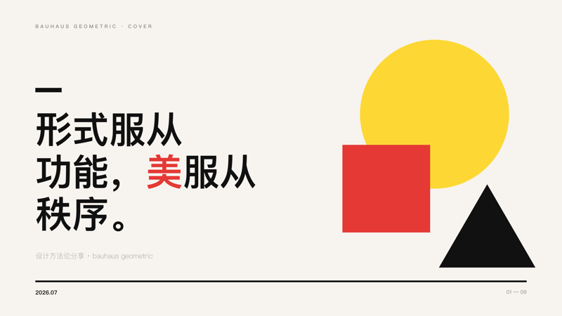
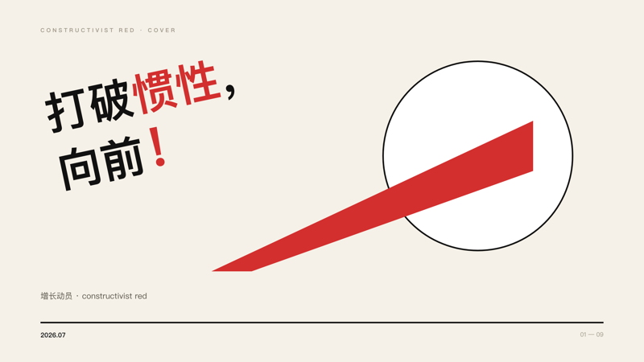
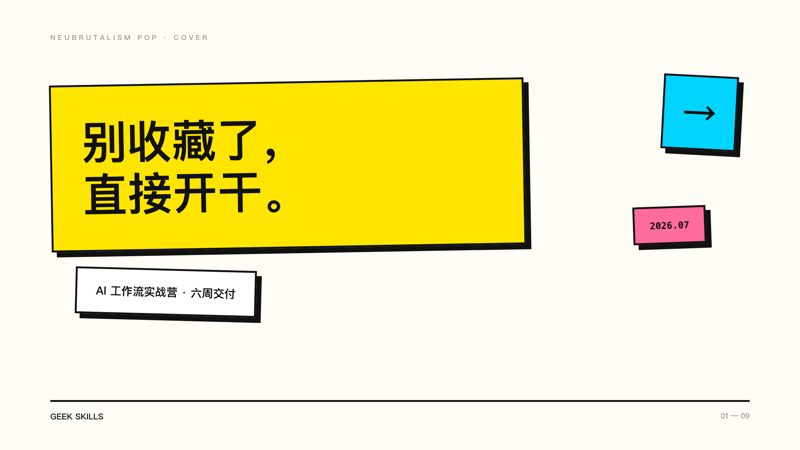
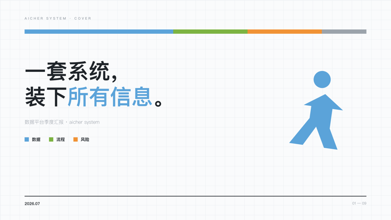

[](README.md) [](README.zh-CN.md)

<div align="center">

# Geek Skills

**13 curated Claude Code skills that ship finished work — decks, research briefs, PRDs, articles, audits.**

End-to-end workflows tested like software, not prompt snippets.

[](https://github.com/staruhub/ClaudeSkills/actions/workflows/validate.yml)
[](#-all-skills)
[](LICENSE)

</div>

## Type this —

```
/deck-studio Turn this quarterly review into a consulting-style deck
```

**— and get a full deck back.** Page one of a real run, scored **7.1/10** by an independent blind judge (7.0 = professional design-studio line):

<!-- TODO: replace static cover with a 30-60s GIF of the run (vhs / ScreenToGif) — research shows animated demos convert measurably better -->
<p align="center">

</p>
<p align="center"><sub>9 pages, produced by the skill itself — no template picked by hand, no manual touch-up. <a href="skills/Geek-skills-deck-studio/examples/constructivist-design-constitution/">Full example →</a></sub></p>

## What will you ship today?

| I need to… | Skill | You get |
|------------|-------|---------|
| Research a decision properly | 🔬 [`deep-research`](skills/Geek-skills-deep-research/SKILL.md) (v8.1) | A cited decision brief — scoped plan → parallel investigation → verified citations |
| Write or review a PRD | 📋 [`product-manager`](skills/Geek-skills-product-manager/SKILL.md) | A PRD your developers can start from, with checkable acceptance bars |
| Present or pitch | 🎞️ [`deck-studio`](skills/Geek-skills-deck-studio/SKILL.md) (v3) | A rendered deck: 17-style library, registered layouts, 22-rule visual gate |
| Publish a Chinese long-form article | ✍️ [`wechat-article-writer`](skills/Geek-skills-wechat-article-writer/SKILL.md) | A publishable article with a built-in anti-translationese pass |

Each is an end-to-end workflow, not a single prompt. [All skills ↓](#-all-skills)

## 🚀 Install in 30 seconds

```bash
git clone https://github.com/staruhub/ClaudeSkills.git && cd ClaudeSkills
python3 scripts/install_skill.py deck-studio      # -> ~/.claude/skills/deck-studio, then run /deck-studio
```

<details>
<summary>Other install options (list all, per-project, manual)</summary>

```bash
python3 scripts/install_skill.py --list                  # see installable names
python3 scripts/install_skill.py deep-research           # any skill by short name
python3 scripts/install_skill.py deep-research --project # -> ./.claude/skills/ (project-level)
```

**Manual:** the installed *directory name* is the slash command, so copy **and rename**:

```bash
cp -r skills/Geek-skills-deep-research ~/.claude/skills/deep-research
```

Copy without renaming → the command becomes `/Geek-skills-deep-research`. Claude also auto-loads a skill when its `description` matches; `/command` is just the explicit way in.

</details>

## 📈 Quality you can re-run, not adjectives

Deck quality is scored by **independent blind judges on an absolute rubric** (10 = design studio, 7 = pro agency) — not by me. The trajectory on the same rubric across four release rounds: 6.0 → 6.6 → 6.6 → **7.1**, first past the studio line. In a 3-judge, position-swapped blind eval, the current pipeline beat the previous one **42.3 vs 29.7**.

Every example directory ships the full generator, rendered pages, and the defects the judges caught:
[constructivist (7.1)](skills/Geek-skills-deck-studio/examples/constructivist-design-constitution/) · [moshiro (3-judge eval)](skills/Geek-skills-deck-studio/examples/moshiro-consulting-report/) · [yinghuang](skills/Geek-skills-deck-studio/examples/yinghuang-bootcamp-proposal/) · [polar-night](skills/Geek-skills-deck-studio/examples/polar-night-ai-native/)

<p align="center">
   
</p>
<p align="center"><sub>Four of the 17 styles — Bauhaus · Constructivist · Neubrutalism · Aicher — each a rendered, reusable seed. Beauty is <em>inherited, not generated</em>.</sub></p>

## 🧪 Maintained like software

- **Skill Quality Standard v1.0** — every skill passes a D0 gate and carries checkable **acceptance criteria**, explicit **boundaries** (when *not* to use, with hand-offs), and **pitfall tables** drawn from real failures.
- **Routing evals** — 85 cases across 10 skills (`skills/*/evals/routing-evals.json`) proving each skill triggers when it should and defers when it shouldn't.
- **CI on every push** — [two L1 gates](.github/workflows/validate.yml) (structure + routing-eval consistency) plus a script compile check. Reproduce locally: `python3 scripts/validate.py && python3 scripts/run_routing_evals.py`.
- **Know what you install** — [SECURITY.md](SECURITY.md) gives a per-skill capability matrix (reads / writes / network / shells out / credentials / can delete). 9 of the 13 curated skills ship zero code; exactly one can delete files, and it defaults to dry-run.

> ⚠️ Quality gates are a **self-audit** by Claude, not third-party certification — the commands above let you re-run them yourself. Full refactor record: [CHANGELOG.md](CHANGELOG.md).

## 📚 All Skills

<a id="-all-skills"></a>

**Flagship** — the four end-to-end workflows above: [deck-studio](skills/Geek-skills-deck-studio/SKILL.md) · [deep-research](skills/Geek-skills-deep-research/SKILL.md) · [product-manager](skills/Geek-skills-product-manager/SKILL.md) · [wechat-article-writer](skills/Geek-skills-wechat-article-writer/SKILL.md)

<details>
<summary><b>Core — professional work</b> (9 skills)</summary>

| Skill | Description |
|-------|-------------|
| [`pair-programming`](skills/Geek-skills-pair-programming/SKILL.md) | Pair-programming partner: delivers code with a structured self-review, focused on AI-specific defects |
| [`security-audit`](skills/Geek-skills-security-audit/SKILL.md) | Comprehensive code security audit |
| [`solution-architect`](skills/Geek-skills-solution-architect/SKILL.md) | System design, tech selection, and architecture review |
| [`threejs-performance`](skills/Geek-skills-threejs-performance/SKILL.md) | Three.js performance optimization |
| [`mineru-pdf-parser`](skills/Geek-skills-mineru-pdf-parser/SKILL.md) | PDF to Markdown or JSON for LLM workflows |
| [`ai-sales-champion`](skills/Geek-skills-ai-sales-champion/SKILL.md) | AI sales/consulting dialogue helper — turn tech into business language |
| [`keqian-method`](skills/Geek-skills-keqian-method/SKILL.md) | Keqian's AI-Native product dev methodology: single-agent, SDD, quality gates |
| [`xuefeng-method`](skills/Geek-skills-xuefeng-method/SKILL.md) | Xuefeng's AI-Native methodology for open-behavior, model-driven products |
| [`c-drive-cleaner`](skills/Geek-skills-c-drive-cleaner/SKILL.md) | Windows C drive cleanup and disk space management (dry-run by default) |

</details>

**Lab** — experimental and personal skills (exam prep, weather reports, image/podcast generation, A-share analysis) live in [`lab/`](lab/). They are **not part of the curated set**, are excluded from the quality gates above, and may graduate into `skills/` or move out of this repo.

<details>
<summary><b>Upstream-synced</b> (1)</summary>

| Skill | Notes |
|-------|-------|
| [`llm-wiki`](llm-wiki/SKILL.md) | Preserved in original upstream layout at repo root |

</details>

## 🤝 Community

Found a bug, or built something with a skill? [Open an issue](https://github.com/staruhub/ClaudeSkills/issues) — maintainer conventions live in [AGENTS.md](AGENTS.md). If a skill saved you an afternoon, a ⭐ helps other people find it.

## License

[MIT](LICENSE)
