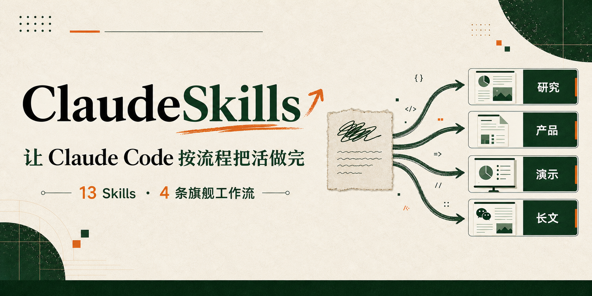
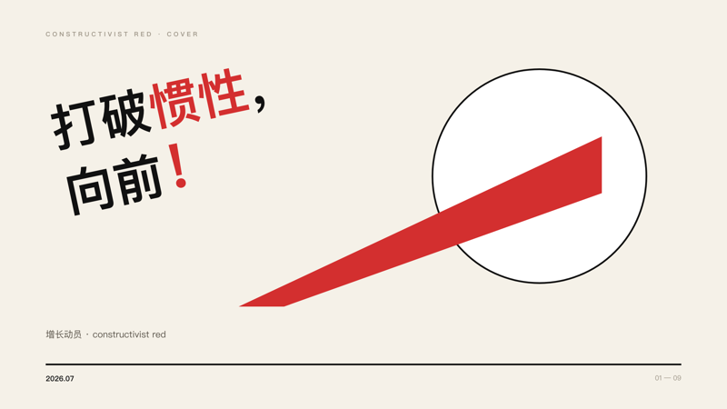
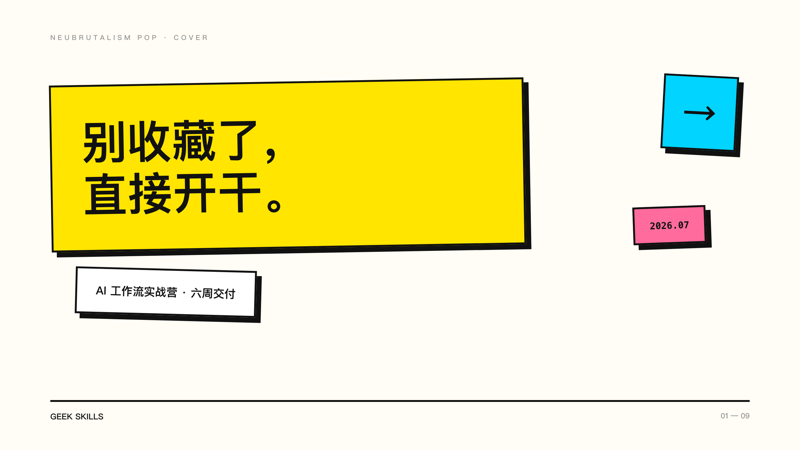
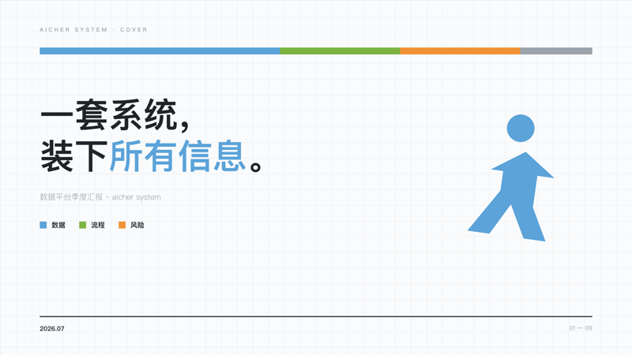

[](README.md) [](README.zh-CN.md)

<p align="center">
  
</p>

<div align="center">

# ClaudeSkills

**给 Claude Code 装上真正能把活做完的工作流。**

13 个精选 Skill，不是零散提示词，而是把步骤、模板、脚本、样例和质量门槛一起装进仓库。先从深度研究、产品文档、演示文稿和微信公众号四条主线开始。

[](https://github.com/staruhub/ClaudeSkills/actions/workflows/validate.yml)
[](LICENSE)

[官网](https://staruhub.github.io/ClaudeSkills/) · [30 秒安装](#-30-秒装好) · [这次更新了什么](#这次更新重点打磨-4-条主线) · [全部 13 个 Skill](#-全部-skill) · [安全说明](SECURITY.md)

</div>

## 这次更新，重点打磨 4 条主线

| 你只要说 | 工作流会怎么推进 | 最后拿到什么 |
|---|---|---|
| “帮我调研三种适合客服团队的 RAG 架构” | 🔬 [`deep-research`](skills/Geek-skills-deep-research/SKILL.md) 先定范围，再做多源检索、来源登记和引用核对 | 有结论、有出处、有取舍和局限说明的简报或完整报告 |
| “别急着写代码，逐个问题把我的想法问清楚” | 📋 [`product-manager`](skills/Geek-skills-product-manager/SKILL.md) 进入 **grill-me-to-doc**：先读仓库证据，每轮只问一个关键决策，中断后还能接着聊 | 可评审的 PRODUCT-DOC、决策记录和未决项；文档批准前不会跳去实现 |
| “把这份季度复盘做成咨询风 PPT” | 🎞️ [`deck-studio`](skills/Geek-skills-deck-studio/SKILL.md) 先确认大纲，再做逐页 brief、注册版式和画面复核 | PPT 内容稿、逐页视觉稿或信息图组图，按你选的交付模式输出 |
| “把这些笔记写成公众号文章，还要配图提示词和排版” | ✍️ [`wechat-article-writer`](skills/Geek-skills-wechat-article-writer/SKILL.md) 可单独写正文，也可串起 `article` → `image-prompts` → `layout` | 文章、配图提示词 manifest 和微信安全的内联 HTML；不会把提示词冒充成图片，也不会自动发布 |

这四条主线都把“中间怎么做”写了出来。你可以看到它什么时候追问、读哪些参考文件、运行哪些校验、停在哪里，而不是只拿到一句神秘 prompt。

## 🚀 30 秒装好

先装一个最常用的：

```bash
git clone --depth 1 https://github.com/staruhub/ClaudeSkills.git && cd ClaudeSkills
python3 scripts/install_skill.py deck-studio
```

然后在 Claude Code 里输入：

```text
/deck-studio 把这份季度复盘做成一套 8 页的咨询风汇报
```

安装脚本会把它复制到 `~/.claude/skills/deck-studio`。想换别的，把 `deck-studio` 改成 `deep-research`、`product-manager` 或 `wechat-article-writer`。

<details>
<summary><b>其他装法、更新、卸载与常见问题</b></summary>

```bash
python3 scripts/install_skill.py --list                  # 查看全部短名
python3 scripts/install_skill.py deep-research           # 安装任意一个
python3 scripts/install_skill.py deep-research --project # 只装到当前项目
```

手动复制时，记得把目录改成你想要的命令名：

```bash
cp -r skills/Geek-skills-deep-research ~/.claude/skills/deep-research
```

装好后的**目录名**就是斜杠命令名。没有改名，命令就会是 `/Geek-skills-deep-research`。

```bash
git pull && python3 scripts/install_skill.py deck-studio --force   # 更新
rm -rf ~/.claude/skills/deck-studio                                # 卸载
```

- **装了却看不到命令？** 先检查安装后的目录名。
- **没有自动触发？** 自动加载会匹配 Skill 的 `description` 和你的说法；直接输入 `/命令` 最稳。
- **`git pull` 后要重装吗？** 要。安装的是一份副本。

</details>

## 这不是又一个 prompt 合集

| 一段临时 prompt | ClaudeSkills |
|---|---|
| 这次聊完，下次从头再来 | 工作流、模板和参考资料都在版本库里，可以复用和改进 |
| 直接冲向答案，中间过程靠模型临场发挥 | 先定输入、步骤、停止条件和交付物；关键节点可以检查 |
| 对话一断，决策很容易丢 | 需要连续性的工作流会落状态和交接文件，例如 grill-me-to-doc 与研究增量更新 |
| “看起来不错”就是唯一标准 | 能确定的部分交给 schema、脚本、fixture 和失败用例；主观质量仍明确留给人审 |
| 装完才发现它要联网、跑命令或写文件 | [`SECURITY.md`](SECURITY.md) 逐个说明读写、联网、命令、凭证和删除能力 |

Skill 能做到哪一步，仍取决于当前 Claude Code 会话里的工具和权限。这个仓库负责把流程和边界说清楚，不替你绕过权限，也不把静态门禁包装成生产效果。

## 60 秒试一条

| 如果你正在做 | 直接这样说 | 先看哪里 |
|---|---|---|
| 技术选型、竞品或政策研究 | `/deep-research 对比……，给管理层一份带引用的决策简报` | [研究方法与产物](skills/Geek-skills-deep-research/SKILL.md) |
| 把模糊想法变成产品文档 | `/product-manager grill me to doc：我想做一个……` | [单问题访谈协议](skills/Geek-skills-product-manager/references/GRILL-ME-TO-DOC.md) |
| 做汇报、路演或培训材料 | `/deck-studio 把……做成 10 页……风格的 deck` | [版式库与交付模式](skills/Geek-skills-deck-studio/SKILL.md) |
| 写公众号正文、配图提示词和 HTML | `/wechat-article-writer full-pipeline：把……写成……` | [四种执行模式](skills/Geek-skills-wechat-article-writer/SKILL.md) |

不用一次装完 13 个。挑一个你本周就会用到的，跑通，再决定要不要留下。

## 先看成品，再决定要不要装

Deck Studio 仓库里保留了生成器、渲染页面、量表和评审意见。下面是 17 套已渲染风格种子中的 4 套：

<p align="center">
   
</p>

[构成主义样例](skills/Geek-skills-deck-studio/examples/constructivist-design-constitution/) · [墨白咨询报告](skills/Geek-skills-deck-studio/examples/moshiro-consulting-report/) · [英黄训练营提案](skills/Geek-skills-deck-studio/examples/yinghuang-bootcamp-proposal/) · [极夜 AI Native](skills/Geek-skills-deck-studio/examples/polar-night-ai-native/)

仓库记录的盲评**模型自测**中，构成主义样例按公开量表得到 **7.1/10**；三评委、对调位置的比较中，新管线是 **42.3 比 29.7**。这是可复查的项目内证据，不是第三方认证。

<details>
<summary><b>看看四条旗舰工作流是怎么验收的</b></summary>

| 检查 | 当前能证明什么 | 不能证明什么 |
|---|---|---|
| `python3 tests/task_b/run_contract_tests.py` | 17 个确定性合同用例覆盖四条旗舰工作流的正常、恢复和失败路径；Deck 还经过真实 Chrome 渲染与 PPTX 组装 | 未来任意模型输出的主观质量、真实图片提供方或微信发布 |
| `python3 scripts/validate.py` | 13 个精选 Skill 的目录和结构符合仓库合同 | 每个 Skill 都跑过真实业务 E2E |
| `python3 scripts/run_routing_evals.py` | 10 个 Skill、91 条路由用例定义的 schema、目标、唯一性和冲突检查通过 | 大模型真实执行时的路由准确率 |
| Python / Node 编译检查 | 仓库内 13 个 Python 文件和 7 个相关 JavaScript 文件可以解析 | 网络、外部工具和生产环境可用性 |
| Deck 样例目录 | 有生成器、渲染页、量表、分数和已记录缺陷 | 独立外部认证 |

基础门禁可直接重跑：

```bash
python3 scripts/validate.py
python3 scripts/run_routing_evals.py
python3 scripts/validate_site.py
```

完整的独立验收记录在 [`verification/2026-07-30/README.md`](verification/2026-07-30/README.md)。

</details>

## 📚 全部 Skill

<a id="-全部-skill"></a>

**旗舰（4 个）**

[deck-studio](skills/Geek-skills-deck-studio/SKILL.md) · [deep-research](skills/Geek-skills-deep-research/SKILL.md) · [product-manager](skills/Geek-skills-product-manager/SKILL.md) · [wechat-article-writer](skills/Geek-skills-wechat-article-writer/SKILL.md)

<details>
<summary><b>专业工作（9 个）</b></summary>

| Skill | 用来做什么 |
|---|---|
| [`pair-programming`](skills/Geek-skills-pair-programming/SKILL.md) | 写代码并做结构化自审，专盯 AI 代码常见缺陷 |
| [`security-audit`](skills/Geek-skills-security-audit/SKILL.md) | 审查代码和依赖的安全问题 |
| [`solution-architect`](skills/Geek-skills-solution-architect/SKILL.md) | 系统设计、技术选型和架构评审 |
| [`threejs-performance`](skills/Geek-skills-threejs-performance/SKILL.md) | 排查和优化 Three.js 性能 |
| [`mineru-pdf-parser`](skills/Geek-skills-mineru-pdf-parser/SKILL.md) | 用本机 MinerU 把 PDF 转成 Markdown 或 JSON |
| [`ai-sales-champion`](skills/Geek-skills-ai-sales-champion/SKILL.md) | 把技术能力讲成客户听得懂的业务价值 |
| [`keqian-method`](skills/Geek-skills-keqian-method/SKILL.md) | 单 Agent、SDD 和质量门禁驱动的产品开发方法 |
| [`xuefeng-method`](skills/Geek-skills-xuefeng-method/SKILL.md) | 行为开放、模型驱动的 AI Native 产品方法 |
| [`c-drive-cleaner`](skills/Geek-skills-c-drive-cleaner/SKILL.md) | 带护栏的 Windows C 盘清理，默认只演习不删除 |

</details>

**实验区**

备考、天气报告、图像和播客生成、A 股分析等个人向或实验性 Skill 放在 [`lab/`](lab/)。它们不计入上面的 13 个精选 Skill，也不进入同一套门禁。

<details>
<summary><b>上游同步（1 个）</b></summary>

[`llm-wiki`](llm-wiki/SKILL.md) 用来给代码库建立 Wiki，源自 [Karpathy 的 LLM Wiki 模式](https://gist.github.com/karpathy/442a6bf555914893e9891c11519de94f)，在仓库根目录保留上游结构。

</details>

## 一起来把它做得更好

发现 bug，或者用某个 Skill 做出了东西？[提个 issue](https://github.com/staruhub/ClaudeSkills/issues)，最好带上脱敏后的输入、产物和复现步骤。想投稿新 Skill？先看 [CONTRIBUTING.md](CONTRIBUTING.md)：新内容从 [`lab/`](lab/) 孵化，过门禁后再进入精选目录。

如果它确实帮你少走了弯路，点个 ⭐，也把它转给那个总在重复写提示词的人。Star 能让更多人看见它，但不是质量认证。

微信群宣传图和配套文案已经放在 [`assets/social/`](assets/social/)。

## License

[MIT](LICENSE)
