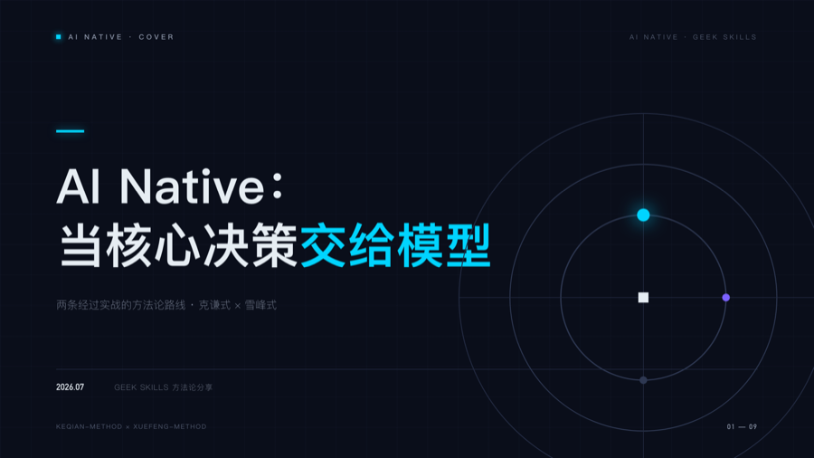

# Example — 极夜科技 · AI Native 方法论（HTML 渲染管线）

deck-studio 的**暗色系**样例：9 页 AI Native 主题技术分享（内容取自本仓库
keqian-method × xuefeng-method）。独立评审绝对分 6/10（专业级），按评审四条
修复迭代到 v5.1：封面大尺度同心环母题、分界页"格栅 vs 发散节点"示意图、
列表数字锚点、全角标点。



## 管线

```bash
npm i pptxgenjs
node generate.js          # html/p1..p9.html
CHROME="/Applications/Google Chrome.app/Contents/MacOS/Google Chrome"
for i in $(seq 1 9); do "$CHROME" --headless=new --screenshot=png/p$i.png \
  --window-size=1280,720 --force-device-scale-factor=2 --hide-scrollbars html/p$i.html; done
node assemble.js          # -> ai-native-methodology.pptx(含逐页 speaker notes)
```

## 设计要点

- 极夜科技 token：深蓝黑底 / 青蓝唯一主强调（紫仅作对位点缀）/ 发光每页 ≤2 处
- **内容即视觉**：最强页是概率乘 `0.99⁵¹ = 0.59` 的数字对撞——先想视觉论点,再排版
- 卡片内部三段网格（标题/示意图/论据+结论），消灭"头重-空腹-脚轻"
- 灰顶线 vs 青顶线做语义对位，不要"有 vs 无"（读作遗漏）

## 已知坑

- 中文正文标点必须全角（"所以:"→"所以："），半角冒号逗号在大屏上极其廉价
- 上标数字（⁵¹）与底数间距要手工收紧，否则读作两个元素
